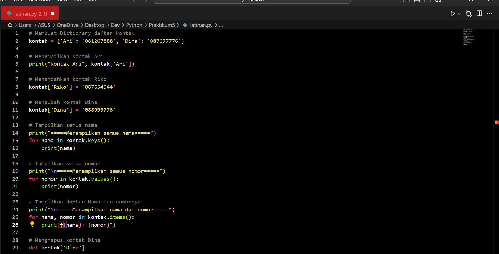

# Praktikum 5
# Latihan
## Membuat Dictionary daftar kontak
```kontak = {'Ari': '081267888', 'Dina': '087677776'}```

## Menampilkan Kontak Ari
```print("Kontak Ari", kontak['Ari'])```

## Menambahkan kontak Riko
```python kontak['Riko'] = '087654544'```

## Mengubah kontak Dina
```python kontak['Dina'] = '088999776'```

## Tampilkan semua nama
```python print("=====Menampilkan semua nama=====")
for nama in kontak.keys():
    print(nama)
```

## Tampilkan semua nomor
```python print("\n=====Menampilkan semua nomor=====")
for nomor in kontak.values():
    print(nomor)
```

## Tampilkan daftar Nama dan nomornya
```python print("\n=====Menampilkan nama dan nomor=====")
for nama, nomor in kontak.items():
    print(f"{nama}: {nomor}")
```

## Menghapus kontak Dina
```python del kontak['Dina']```




# Praktik
## Program Data Mahasiswa


